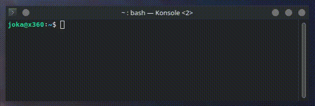
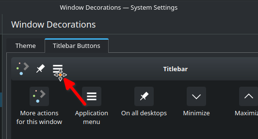

## material-decoration or breeze enhanced

Material-ish or breeze enhanced window decoration theme for KWin.

### Locally Integrated Menus

This hides the AppMenu icon button and draws the menu in the titlebar.


Make sure you add the AppMenu button in System Settings > Application Style > Window Decorations > Buttons Tab.

TODO/Bugs ([Issue #1](https://github.com/Zren/material-decoration/issues/1)):

* Open Submenu on Shortcut (eg: `Alt+F`)
* Display mnemonics when holding `Alt`

Upstream LIM discussion in the KDE Bug report: https://bugs.kde.org/show_bug.cgi?id=375951#c27

### Installation

#### Binary package

- Arch/Manjaro (AUR):  
  Install the `material-kwin-decoration-git` AUR package.  
  https://aur.archlinux.org/packages/material-kwin-decoration-git/

- openSUSE:  
  https://build.opensuse.org/package/show/home:trmdi/material-decoration
```
sudo zypper ar obs://home:trmdi trmdi
sudo zypper in -r trmdi material-decoration
```

#### Building from source
Build dependencies:

- Ubuntu:
```
sudo sed -i 's,^# deb-src,deb-src,g' /etc/apt/sources.list
sudo apt update
sudo apt build-dep breeze kwin
```


Download the source:

```
cd ~/Downloads
git clone https://github.com/Zren/material-decoration.git
cd material-decoration
```

Then compile the decoration, and install it:
- Ubuntu:
```
dpkg-buildpackage -us -uc
sudo dpkg -i ../kwin-style-material-breeze-enhanced*.deb
```

- Others:
```
mkdir build
cd build
cmake -DCMAKE_INSTALL_PREFIX=/usr ..
make
sudo make install
```

Select Material in System Settings > Application Style > Window Decorations.

To test changes, restart `kwin_x11` with:

```
QT_LOGGING_RULES="*=false;kdecoration.material=true" kstart5 -- kwin_x11 --replace
```

#### Configure

Select the theme in window decorations page.

In the Titlebar Buttons page settings tab add the Application Menu "button" to the titlebar as below



### Update

On 2020 June 18, the kdecoration id was changed from `zzag` to `zren`. You will need to re-select `Material` in System Settings > Application Style > Window Decoration. KWin will fallback to `Breeze` if you forget to do this.

#### Building from source

First navigate to the source directory, and `git pull` recent changes.

```
cd ~/Downloads/material-decoration
git pull origin master --ff-only
```

Then re-run the install instructions.


# Credits:
[material-decoration](https://github.com/Zren/material-decoration), [BreezeEnhanced](https://github.com/tsujan/BreezeEnhanced) that is based on [BreezeBlurred](https://github.com/alex47/BreezeBlurred) which in turn is based on Breeze.

